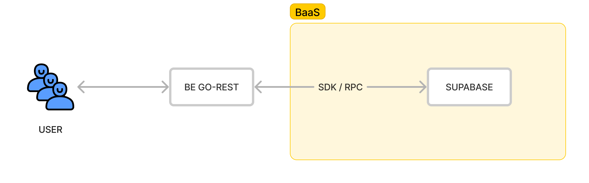

# go rest using supabase

## installation

install golang and install air livereload

install dependency
`go get`

using live reload `air`

## flow

## postman collection
[postman collection](.theme/go-rest-supabase.postman_collection.json)
